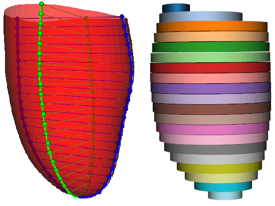
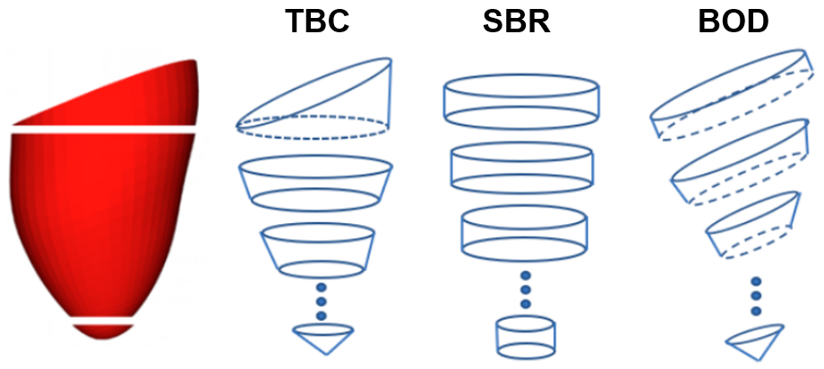
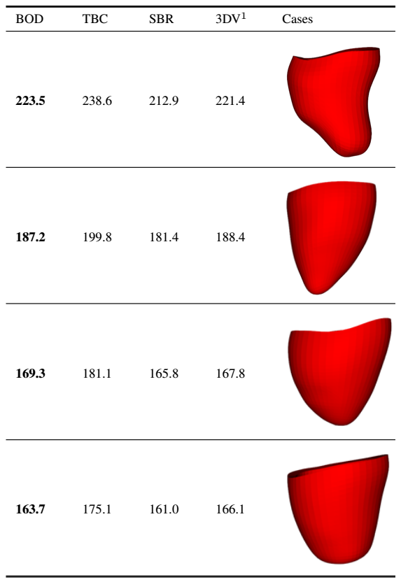

## Overview

**simpsonsvolume** is a toolbox used for volumetric analysis of 3D anatomical meshes of the **left ventricle**. The meshes are reconstructed a retrospective cohort representative of:

* an adult population [UK Biobank Imaging Study](http://imaging.ukbiobank.ac.uk/)
* a young population (preterm) 
* an elderly heart failure population.

<p align="center">

</p>

This project aims to estimate left ventricular volumes using 3 different interpretations of **Simpson's bi-plane rule (SBR)**:
1. Apical-view generation
2. Parallel landmark extraction 
3. Simpson's disk formation
4. Final volume calculation

<p align="center">
  
   
</p>

<p align="center">
  
</p>

**Note** This repository only contains the code, not the imaging data. The meshes have been made publicly available here: dx.doi.org/10.6084/m9.figshare.14933463

## Installation

The toolbox is developed using [Python](https://www.python.org) programming language. The toolbox is developed specifically using Python 3.7.

The toolbox depends on some external libraries which need to be installed, including:

* vtk for mesh manipulation;
* numpy and scipy for numerical computation;
* matplotlib for data visulisation;
* pandas for handling spreadsheet;
* vg for geometrical calculations;

The most convenient way to install these libraries is to use pip3 (or pip for Python 2) by running this command in the terminal:
```
pip3 install numpy scipy matplotlib pandas vtk vg
```

## Input/Output Structure

The format of the datastructure must follow the tree outlined below as all the following data visuzalition work requires this specific format.

```
root
│   README.md  
│
└───data_handlers
│   │   data_viz.py
│   │   heart.py
│   │   rv_dir_.py
│   │   vtkfunctions.py
│   │   vtkslicer.py
│   
└───meshes
│   │
│   └──xxx_meshes (population: UKBB, YHC, HFC)
│       │   Case1.vtk
│       │   Case2.vtk
│       │   ...
│       │   anomaly.txt
│       │   apex_manual.txt
│       │   apex_nodes.txt
│    
└───output
│   └───xxx_meshes (population: UKBB, YHC, HFC)
│       └───xxx (method: BOD, TBC, SBR)
│          └───xx (viewing angle: 90, 60)
|              |  Case1_data_dict.pkl
|              |  Case2_data_dict.pkl
|              | ...
│   
└───options 
│   │
│   └──export_config.py
```

## Input 

The input is a collection of vtk anatomical (LV) meshes with node correspondence. The meta-data must include:
  * the direction of the right ventricle (RV) or the location of the centre-of-mass (COM) of the RV (for A4C view acquisition)
  * the vertex indices of the endo- and epicardium layers of the LV
  * the vertex indices of the inner- and outer-rim of the LV base.
 
<p align="center">

</p>
 
**Note** If using our publicly available cohort, the RV directions are already built-in and require only the Orientations3D folder path in the `--rv_path` option.
## Options

The main script for generating data is `create_dataset.py`. Options are controlled at several different levels:

1. **General options**: These options include parameters such as the location of the vtk mesh files and the output directory, which population to use, what view (slice) should be extracted, which Simpson's interpretation to use, number of Simpson's disks, and some additional parameters. An overview of these parameters can be seen by running `create_dataset.py -h` or looking at the argument parser defined in `export_config.py`.
2. **Data-specific options**: There may be cases where several parameters need to be defined for a given dataset. For example in each dataset, the endo- and epicardium apex node indices are fixed, but there are certain cases which need manual indexing or are excluded all-together. These parameters can be manually set in the `apex_nodes.txt`, `apex_manual.txt` and `anomaly.txt` files.
3. **Pipeline flow options**: These are options to skip certain subsections of the vtk pipeline (useful if data has already been calculated and stored):
  * `--exclude_landmarks`: Skips through the apical view generation and landmarks extraction process. 
  * `--exclude_volume`: Skips through the Simpson's volume estimation. 
  * `--exclude_mesh_traits`: Skips through the calculation of LV specific traits (e.g. cross-sectional eccentricity).
  * `--exclude_eccent_profile`: Skips through the plots of eccentricity profiles.

**Note** When skipping subsections, the required data for subsequent pipelines are loaded from the already existing data in `--output_dir`.
## Run from terminal

* To run the UKBB population with the apical-3 chamber view:

`python ../create_dataset.py --output_dir ../output/ --vtk_mesh_dir ../meshes/ --nodelabels_dir ../meta_data/ --rv_path ../Orientations3D/ --dataset_type UKBB --num_disks 20 --view_name a3ch --a4c_offset 20 --simpson_type 0 1 2 --ptsz_disp 2 --verbose --export_pkl`

**Note** The output data is only saved when given the `--export_pkl` option.


* To run all 3 populations, with both apical-2 and 3 chamber views:

`python ../create_dataset.py --output_dir ../output/ --vtk_mesh_dir ../meshes/ --nodelabels_dir ../meta_data/ --rv_path ../Orientations3D/ --dataset_type UKBB YHC HFC --num_disks 20 --view_name a3ch a2ch --a4c_offset 20 --simpson_type 0 1 2 --ptsz_disp 2 --verbose --export_pkl`


* We provide data visualization functions to analyze LV volume estimates as well as additional anatomical metrics such as LV eccentricity, basal slanting and orientation angle. To run the data visualization pipeline:

`python ../visualize_data.py --data_dir ../output/ --img_dir ..docs/Heart_normal_short_axis_section.jpg --plot_mu --plot_Am --plot_bs`

<p align="center">


</p>


